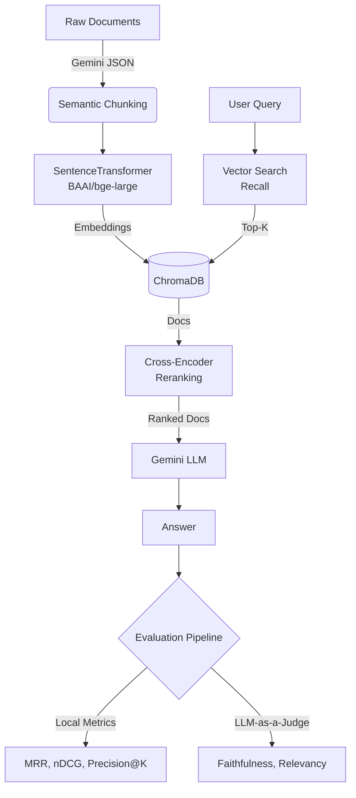
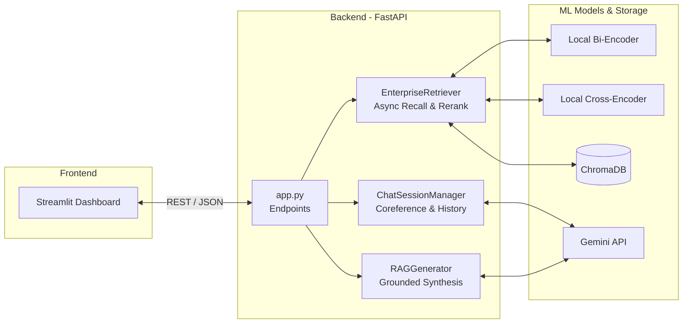

# 🚀 Enterprise Financial RAG Pipeline & Foundations

[](https://deepmind.google/technologies/gemini/)
[](https://huggingface.co/BAAI/bge-large-en-v1.5)
[](https://fastapi.tiangolo.com/)
[](https://www.trychroma.com/)
[](https://docs.ragas.io/)
[](https://www.docker.com/)

A production-grade, two-stage Retrieval-Augmented Generation (RAG) architecture built to parse, retrieve, and synthesize financial insights from SEC 10-K reports using the [`virattt/financial-qa-10K`](https://huggingface.co/datasets/virattt/financial-qa-10K) dataset.

This repository demonstrates the transition from theoretical AI research to highly scalable backend ML systems. It pairs a mathematical evaluation sandbox with an asynchronous, containerized REST API, bypassing bloated frameworks in favor of custom, deterministic, and highly optimized Python architectures powered by Gemini Flash and local BAAI embedding models.

## 📑 Table of Contents

* [Tech Stack](#-tech-stack)
* [The Dual-Core Architecture](#️-the-dual-core-architecture)
  * [Core 1: The Laboratory (`01_rag_foundations`)](#core-1-the-laboratory-01_rag_foundations)
  * [Core 2: The Production Runtime (`02_enterprise_production_rag`)](#core-2-the-production-runtime-02_enterprise_production_rag)
* [Architectural Upgrades & System Design](#-architectural-upgrades--system-design)
* [Repository Structure](#-repository-structure)
* [UI & Trace Attribution Gallery](#-ui--trace-attribution-gallery)
* [Quickstart (Windows / Linux)](#️-quickstart-windows--linux)
* [License](#-license)

---

## 📊 Tech Stack

* **AI/ML & LLMs:** Google Gemini 3.5 Flash / Flash-Lite, SentenceTransformers (`BAAI/bge-large-en-v1.5`), Cross-Encoders (`BAAI/bge-reranker-base`)
* **Evaluation:** RAGAS (Context Precision, Answer Relevancy, Faithfulness), Scikit-Learn (t-SNE)
* **Backend:** Python 3.12, FastAPI, Uvicorn, Pydantic, AsyncIO, Tenacity
* **Data & Storage:** ChromaDB (Cosine HNSW Index), HuggingFace Datasets (`virattt/financial-qa-10K`)
* **DevOps & UI:** Docker, Docker Compose, Streamlit, Plotly

---

## 🏗️ The Dual-Core Architecture

Building LLM applications requires separating the evaluation environment from the production runtime. This repository models that exact enterprise lifecycle.

### Core 1: The Laboratory (`01_rag_foundations`)
Before serving users, an AI system must be mathematically validated. Core 1 is the sandbox where we prove the pipeline to benchmark retrieval strategies, determine optimal chunk sizes, and quantify model hallucinations before writing production API code.

* 📊 **Offline IR Metrics:** Zero-framework implementations of classic Information Retrieval benchmarks—calculating Mean Precision@3, Mean Hit Rate@3 (Recall proxy), Mean Reciprocal Rank (MRR), and nDCG@5 against ground-truth keywords.
* 🤖 **Custom LLM-as-a-Judge:** Lightweight, zero-framework evaluation engine using Gemini structured outputs (`RAGJudgeVerdict`) to score Faithfulness (1–5), Answer Relevancy (1–5), and generate qualitative critiques alongside lexical Keyword Coverage tracking.
* 🛡️ **Resilient API Orchestration:** Rate-limit protection with exponential backoff retries (`tenacity`), request delay pacing, and incremental disk caching (`eval_results_cache.json`) to prevent data loss.
* 🗺️ **Dimensionality Reduction:** 2D and 3D t-SNE projections using Scikit-Learn and interactive Plotly charts to visualize semantic embedding clusters across document categories.


---

### Core 2: The Production Runtime (`02_enterprise_production_rag`)
Once validated, the architecture is hardened into a containerized microservices deployment designed to serve concurrent users with sub-second retrieval latency, robust state management, and continuous uptime.

* 🔌 **Microservices Architecture:** Decouples the application into two independent Docker containers: a lightweight Streamlit UI and a heavy FastAPI ML backend - ensuring clean separation of concerns, isolated fault tolerance, and independent scalability.
* ⚡ **Non-Blocking Async Backend:** Preloads neural weights at boot via FastAPI lifespans. CPU-heavy retrieval tasks are offloaded to background threads (`asyncio.to_thread`), preventing event loop blocking.
* 🧠 **Stateful Query Rewriting:** Implements LLM coreference resolution with a bounded sliding window memory (e.g., rewriting *"What was their profit?"* into *"What was Apple's profit?"*) and automatic Ticker entity extraction, eliminating context-window bloat.
* 🛡️ **Strict Structured Synthesis:** Maps Gemini's Structured Outputs to Pydantic models, strictly enforcing evidence-backed answers, document citations, and an is_grounded flag to prevent hallucinations.
* 💾 **Idempotent ETL Pipeline:** Uses MD5 hashing for stable chunk IDs to prevent ChromaDB duplication, and injects explicit ticker metadata to improve vector search accuracy.
* 🔍 **Trace Attribution UI:** Features an expandable Streamlit UI trace that exposes internal telemetry—allowing users to audit latency, cross-encoder scores, rewritten queries, and retrieved snippets.


---

## ⚡ Architectural Upgrades & System Design

| Feature | Core 1 (Foundations) | Core 2 (Production) | Engineering Rationale |
| :--- | :--- | :--- | :--- |
| **Retrieval Engine** | Synchronous Two-Stage | Async Two-Stage + Metadata Filtering | Both cores utilize `BAAI` bi-encoders and cross-encoders. Core 2 offloads the heavy neural network predictions to thread pools (`asyncio.to_thread`) to prevent blocking the FastAPI event loop, and adds exact-match entity filtering before reranking. |
| **Data Processing** | In-memory LLM parsing | Streamed ETL pipeline | `ingest_data.py` processes SEC 10-K datasets in chunks with ticker injection to prevent CPU/RAM bottlenecking during vectorization. |
| **State Management** | Stateless / Manual | Conversational Session Store | In-memory sliding window dictionary maps `session_id` to chat histories for multi-turn contextual awareness without memory leaks. |
| **Response Synthesis** | Unstructured Strings | Strict Pydantic Models | Gemini 3.5 Beta API forces structured JSON outputs ensuring `is_grounded` boolean flags and exact source citations are tracked. |
| **Latency Optimization**| Synchronous notebook cells | Async FastAPI + Model Caching | Models are cached locally via Docker volumes and loaded into global app state at server boot. Tasks are offloaded via `asyncio.to_thread`. |

### 📁 Repository Structure

```text
enterprise-rag-evaluation
├── 01_rag_foundations/
│   ├── data/
│   │   ├── knowledge-base/       # Raw Markdown documents
│   │   └── tests.jsonl           # Golden dataset for RAGAS evaluation
│   ├── notebooks/
│   │   └── RAG_foundations_Masterclass.ipynb  # Core educational notebook
│   └── scripts/
│       └── custom_eval.py        # Custom retrieval & generation metrics (nDCG, MRR, LLM-as-a-Judge)
│
├── 02_enterprise_production_rag/
│   ├── api/
│   │   ├── app.py                # FastAPI asynchronous backend
│   │   ├── chat_manager.py       # Session memory & coreference resolution
│   │   └── generate.py           # Strictly grounded response generation
│   ├── data/
│   │   └── chroma_sec_db/        # Persistent ChromaDB vector storage
│   ├── src/
│   │   ├── ingest_data.py        # SEC-10K data chunking & embedding pipeline
│   │   └── retrieve.py           # Async Two-Stage Retriever (Recall + Rerank)
│   ├── ui/
│   │   └── streamlit_app.py      # Interactive chat dashboard with trace attribution
│   ├── evaluate/
│   │   └── evaluate_pipeline.py  # Automated RAGAS benchmarking pipeline
│   └── assets/
│       └── screenshots/          # 📸 Folder containing app running screenshots
│           ├── ui_dashboard.png
│           ├── engine_controls.png
│           ├── ticker.png
│           ├── connection_error.png
│           ├── trace_attribution.png
│           └── evaluation_metrics.png
│
├── docker-compose.yml       # Multi-container orchestration
├── Dockerfile               # Application environment specification
└── requirements.txt         # Manage Python project dependencies

```
---

### 📸 UI & Trace Attribution Gallery
All visual assets and execution screenshots for the dashboard, engine telemetry, and evaluation metrics are located in [02_enterprise_production_rag/assets/screenshots/](02_enterprise_production_rag/assets/screenshots/).

### 🛠️ Quickstart (Windows / Linux)

**1. Clone & Configure**
```bash
git clone https://github.com/Subhrajyoti8520/enterprise-rag-evaluation.git
cd enterprise-rag-evaluation
echo "GEMINI_API_KEY=your_api_key_here" > .env
```

**2. Local Database Initialization (Recommended)**
To avoid Docker timeouts during the initial HuggingFace model downloads, build the vector database locally first.
```bash
# Create and activate a virtual environment
python -m venv venv
# Windows:
venv\Scripts\activate
# Mac/Linux:
source venv/bin/activate

# Install dependencies and run ingestion
pip install -r requirements.txt
python 02_enterprise_production_rag/src/ingest_data.py
```
*(Note: By default, this runs in fast ingestion mode, sampling 500 records. Edit `IngestionConfig` in `ingest_data.py` to ingest the full dataset).*

**3. Launch the Microservices**
```bash
docker-compose up --build -d
```
* Streamlit UI: http://localhost:8501

* FastAPI Docs: http://localhost:8000/docs

**4. Run RAGAS Pipeline Evaluation (Optional)**
```bash
python 02_enterprise_production_rag/evaluate/evaluate_pipeline.py
```
---

## 📄 License

This project is licensed under the MIT License - see the [LICENSE](LICENSE) file for details.


